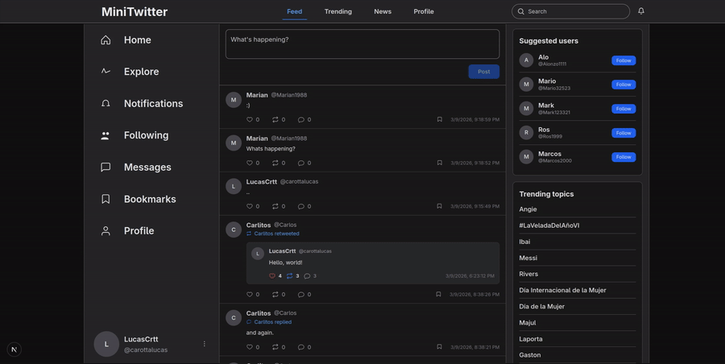

# Twitter-like Frontend (Next.js)


## Project Description

This project was developed for learning purposes. It is a web application inspired by Twitter, with a minimalist approach that prioritizes functionality and architecture over visual design.

The frontend is built with Next.js (App Router) and communicates with a backend API via proxy routes. The application provides a responsive and accessible interface and includes features such as user authentication, an infinite feed, profiles, tweet creation, bookmarks, notifications, and near real-time behaviors.

## Tech Stack

- Framework: Next.js (App Router)
- Language: TypeScript
- UI: React 19, Tailwind CSS (v4), custom components
- HTML5/CSS3
- Authentication: NextAuth (session management)
- Utilities & styling: Tailwind CSS, class-variance-authority, clsx
- Icons: lucide-react
- Realtime / Sockets: socket.io-client (where applicable)
- Tools: ESLint, TypeScript
- Deployment: Ready for Vercel / Node (standard Next.js deployment)

## Main Implemented Features

- Authentication flows: register, login, token refresh, logout, and session-dependent UI

	
- Feed and pagination: infinite feed with cursor-based pagination and normalization of different backend responses

	
- Tweet actions: create tweet, reply, like, retweet, and bookmark

	
- Profiles: view user profiles, follow/unfollow, counters, and followers/following lists

	
- Notifications: real-time notifications, paginated list, mark-as-read, and deep links to content

	
- Bookmarks: list, add, and remove bookmarks for tweets

	
- Trending topics & suggested users: response normalization and dedicated UI components

	
- Shared types: the `types/` folder consolidates TypeScript interfaces (Tweet, User/Profile, Notification, TrendingTopic)
- Component library: a small set of reusable components (`Button`, `Card`, `Input`) with variants via `class-variance-authority`
- Robust fetching: helpers in `lib/` (`tweetsClient`, `bookmarksClient`) that normalize different response shapes
- Accessibility: semantic elements and `focus-visible` styles on interactive controls

## Relevant Technical Details

- App Router: Structure under `app/` with a server/client separation where appropriate.
- TypeScript-first: Domain models centralized in `types/` and used across components and libraries.
- Normalization: The client normalizes different backend response shapes (for example, via `normalizeTweet`).
- Avatar fallbacks: Initials are shown when there is no real avatar; automatically generated avatars (dicebear/identicon/gravatar) are ignored in favor of more consistent initials.
- Progressive enhancement: Components show placeholders and loading states while waiting for data.
- API Proxy: The frontend calls `/api/proxy/*` to simplify CORS handling, use auth cookies, and adapt responses.

## API Proxy

The frontend uses local proxy routes under `/api/proxy/*` to forward requests to the backend server (configured via the `BACKEND_URL` environment variable).

The proxy is used to:

- Simplify CORS handling by avoiding cross-origin requests from the browser.
- Keep authentication cookies on the same origin and allow them to be sent automatically with requests.
- Centralize normalization and adaptation of backend responses before the UI consumes them.

This allows the frontend application to consume a more stable and consistent API without exposing backend implementation details.

## Notable Repository Structure

- `app/` — Next.js routes and pages (App Router)
- `components/` — Reusable UI components (TweetCard, ProfileCard, FollowButton, NotificationsPage, etc.)
- `lib/` — Fetch helpers and utilities (`tweetsClient`, `bookmarksClient`, `normalizeTweet`)
- `types/` — Centralized TypeScript interfaces (`tweet.ts`, `user.ts`, `notification.ts`, `trending.ts`)
- `public/` — Static assets

## Available Scripts

Run these from `package.json`:

```bash
npm run dev      # start development server
npm run build    # build for production
npm run start    # start the built app (default port 3001)
npm run lint     # run ESLint
```

## Challenges & Learnings

- Handling inconsistent response shapes from the backend and normalizing them on the client.
- Integrating NextAuth and managing boundaries between server and client code.
- Balancing client interactivity (optimistic updates for follow/like/bookmark) with eventual consistency from the server.
- Implementing infinite scroll and cursor-based pagination.


## Local Development

1. Copy the example environment file:

```bash
cp .env.example .env.local
```

2. Install and run:

```bash
npm install
npm run dev
```

3. Open `http://localhost:3000`

## Notes / Contact

This frontend is part of a full-stack project. Backend endpoints are consumed through `/api/proxy/*` and require a compatible backend.
